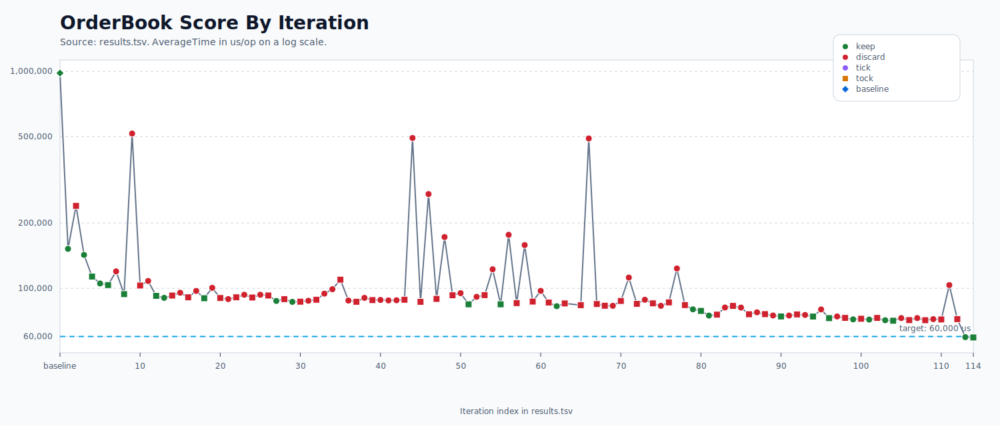

# Experiment Summary

This document summarizes the optimization run recorded in [`results.tsv`](results.tsv).

## Outcome

- Iterations logged: 115
- Kept results: 27
- Initial baseline: `980678.9778 us/op`
- Current kept result: `59394.0308 us/op`
- Net reduction from the original baseline: `93.94%`

The current score history is plotted in [`results-iterations.svg`](results-iterations.svg).

## High-Level Read

The experiment followed a **"Tick-Tock"** optimization rhythm, moving between major structural shifts and tactical refinements:

- **Tick (Structural Breakthroughs):** Early `tick` iterations found the large structural gains by replacing generic collections with specialized primitive structures.
- **Tock (Incremental Refinements):** Mid-stage `tock` iterations harvested smaller wins in map layout, load factors, and intrusive bookkeeping.
- **Late-Stage Specialization:** Progress came from tailoring data structures specifically to the hot paths rather than generic standard-library collections.
- **Selective Cleanup:** Code-quality improvements were kept only when performance-neutral or slightly positive.

## Major Architecture Milestones

These are the notable kept changes that materially moved the implementation forward.

1. `f923a0c`, `tick`, `152026.0751 us/op`, `84.50%`
   Replaced sorted order lists with price levels and intrusive FIFO queues.

2. `fe5c01b`, `tick`, `142582.1776 us/op`, `6.21%`
   Moved best-price selection to per-side heaps plus price hash maps.

3. `84b8b47`, `tick`, `105285.3828 us/op`, `7.12%`
   Replaced object-heavy lookup structures with primitive open-addressed long maps.

4. `212873b`, `tock`, `84433.0980 us/op`, `2.55%`
   Increased the initial order-id map capacity to cut resize churn.

5. `a140f57`, `tick`, `80014.3524 us/op`, `3.31%`
   Replaced object-based resting orders and price levels with primitive slot arrays.

6. `4775ff1`, `tick`, `74919.3668 us/op`, `4.84%`
   Made the order-id map and price-level map intrusive so removals could use stored probe slots.

7. `782d6f0`, `tick`, `71958.7794 us/op`, `1.28%`
   Specialized the side-book price-level map so it owned its slot metadata directly.

8. `f717ace`, `tick`, `71791.1942 us/op`, `0.23%`
   Specialized the order-id map for the same reason.

9. `66c666e`, `tick`, `71291.1524 us/op`, `0.70%`
   Encoded order side in the stored level reference and removed a metadata array.

10. `495b398`, `tock`, `70916.5195 us/op`, `0.53%`
    Lowered the specialized order-id map load factor from `0.6` to `0.55`.

11. `5113473`, `tick`, `59596.5239 us/op`, `15.96%`
    Replaced the level heap plus exact-price hash lookup with a dense rebasing page directory and per-page bitsets. This was the major late-stage breakthrough and pushed the implementation under `60k us/op`.

12. `f416e48`, `tock`, `59394.0308 us/op`, `0.34%`
    Removed dead code and tightened the dense page-directory implementation without changing the core architecture.

## What Consistently Worked

- Replacing object-heavy structures with primitive arrays and primitive maps.
- Making lookup structures intrusive so deletes and updates reused stored probe information.
- Keeping the matching path simple and data-local.
- Trading a modest amount of memory for shorter probe chains when the hot path justified it.
- Specializing maps and side-book metadata instead of routing through more generic helper layers.

## What Consistently Lost

- Swapping in standard-library structures such as `TreeMap`, `TreeSet`, `PriorityQueue`, and `HashMap`.
- Dense ladder or page designs that assumed too much about active price span and paid heavily when the range widened.
- Bit-packing and metadata-compression ideas that added decode/encode work to the hot path.
- Extra caches, tombstones, robin-hood variants, and branch-splitting rewrites that made the implementation more complex without moving the score enough.
- Refactors that pushed tiny helper calls into the hottest traversal loops.

## Current Design Snapshot

The current architecture in [`src/main/java/com/xiaohanc/orderbook/OrderBookImpl.java`](src/main/java/com/xiaohanc/orderbook/OrderBookImpl.java) converged on four ideas:

- **Order Storage:** Orders live in primitive arrays indexed by a "slot" (e.g., `orderIds`, `orderQuantities`). This eliminates object overhead and improves cache locality.
- **Price Levels:** Each price level is an intrusive FIFO queue managed by `levelHeads` and `levelTails` arrays. Orders are linked using `orderNext` and `orderPrev` arrays.
- **Order Lookup:** Uses a specialized intrusive open-addressed `OrderMap` (long-to-int). Removals are $O(1)$ because the map slot is stored with the order.
- **Best-Price Selection:** A dense rebasing page directory where each page covers 64 exact prices. Active pages are tracked with bitsets (`nonEmptyPageWords`), and active prices within a page use a 64-bit mask (`pageMasks`).

## Directory and Level Structure

The `SideBook` organizes prices into a hierarchical structure to balance memory efficiency and lookup speed:

1.  **Price to Page Mapping:**
    *   Prices are grouped into **Pages** of 64 levels each.
    *   `pageKey = price >> 6` identifies the page.
    *   The `SideBook` maintains a `directorySlots` array that maps a `pageKey` to a `pageSlot`.
    *   **Rebasing:** To handle arbitrary price ranges, the directory is "rebased" around a `basePageKey`. `directoryIndex = pageKey - basePageKey`.
2.  **Page Storage (Sparse allocation):**
    *   `pageSlot` is an index into page-level metadata (`pageMasks`, `pageKeys`).
    *   Slots are only allocated when a price within that page becomes active. This keeps the memory footprint small even if prices are far apart.
3.  **Level Indexing:**
    *   Each exact price level is identified by a `levelSlot`.
    *   `levelSlot = (pageSlot << 6) | (price & 63)`.
    *   This flat index allows $O(1)$ access to `levelHeads` and `levelTails` without nested lookups.
4.  **Bitset Acceleration:**
    *   `pageMasks[pageSlot]` (64-bit): Tracks active price offsets within a single page.
    *   `nonEmptyPageWords` (Bitset): Tracks which `directoryIndex` contains an active page.
    *   `nonEmptyPageWordSummary` (Bitset): A second-level summary for faster skipping of empty directory regions.
    *   **Best Price Lookup:** Uses `Long.numberOfTrailingZeros` (Asks) or `Long.numberOfLeadingZeros` (Bids) across these bitsets to find the best price in effectively $O(1)$ time.

## Full Visualization: Order Flow Representation

To provide a "full representation," let’s visualize every array and pointer in the system after adding a single **Buy** order: `addOrder(id=1001, price=150, quantity=10)`.

### 1. SideBook Logic (Bids Side)
The first order triggers the initialization of the **Rebasing Directory**.

*   **Price**: 150 $\rightarrow$ `pageKey = 2` (150 >> 6), `offset = 22` (150 & 63).
*   **Base Key**: `basePageKey = 2 - 2048 = -2046` (assuming initial capacity 4096).
*   **Index**: `directoryIndex = 2 - (-2046) = 2048`.

#### **A. The Price Indexing Arrays**
| Array | Index | Value | Description |
| :--- | :--- | :--- | :--- |
| `directorySlots` | `2048` | `0` | Directory index 2048 maps to `pageSlot 0`. |
| `pageKeys` | `0` | `2` | Confirming `pageSlot 0` belongs to `pageKey 2`. |
| `pageMasks` | `0` | `1L << 22` | The 22nd bit is set for price 150. |
| `pageDirectoryIndexes` | `0` | `2048` | Back-pointer to the directory (for fast deletion). |

#### **B. The Bitmaps (For $O(1)$ Search)**
| Array | Index | Binary Value | Description |
| :--- | :--- | :--- | :--- |
| `nonEmptyPageWords` | `32` | `...00000001` | Bit 0 set (2048 / 64 = 32, remainder 0). |
| `nonEmptyPageWordSummary` | `0` | `...000100...` | Bit 32 set (32 / 64 = 0, remainder 32). |

#### **C. The Level Entry Points**
A `levelSlot` of `22` is calculated (0 << 6 | 22).

| Array | Index (`levelSlot`) | Value | Description |
| :--- | :--- | :--- | :--- |
| `levelHeads` | `22` | `0` | The queue for Price 150 starts at `orderSlot 0`. |
| `levelTails` | `22` | `0` | The queue for Price 150 ends at `orderSlot 0`. |

---

### 2. OrderBookImpl (Global Storage)
These arrays store the actual content of the order at a specific index (`orderSlot`).

| Array | Index (`orderSlot`) | Value | Description |
| :--- | :--- | :--- | :--- |
| `orderIds` | `0` | `1001` | The unique long ID. |
| `orderQuantities` | `0` | `10` | Remaining quantity. |
| `orderLevels` | `0` | `22` | Points back to `levelSlot 22` in Bids. |
| `orderPrev` | `0` | `-1` | No order before this in the queue. |
| `orderNext` | `0` | `-1` | No order after this in the queue. |
| `orderMapSlots` | `0` | `347` | The index in `OrderMap` (for $O(1)$ deletion). |

---

### 3. OrderMap (Global Lookup)
A custom primitive hash map that finds the memory slot from an ID.

| Array | Index | Value | Description |
| :--- | :--- | :--- | :--- |
| `keys` | `347` | `1001` | The Order ID. |
| `values` | `347` | `0` | Maps ID 1001 to `orderSlot 0`. |

---

### **Summary of the "Full Flow" Integration**

1.  **Incoming Price (150)** $\rightarrow$ Calculated `pageKey (2)` and `offset (22)`.
2.  **Directory Lookup** $\rightarrow$ `directorySlots[2 - basePageKey]` gave us `pageSlot 0`.
3.  **Level Mapping** $\rightarrow$ Combined `pageSlot (0)` and `offset (22)` to get `levelSlot 22`.
4.  **Order Storage** $\rightarrow$ Placed order in `orderSlot 0`, set its ID/Qty, and linked it to `levelSlot 22`.
5.  **Linked List Update** $\rightarrow$ Set `levelHeads[22]` to `0` to mark the start of the queue.
6.  **Hash Map Update** $\rightarrow$ Mapped `1001` to `0` so we can find it instantly if it's canceled.

This structure allows the order book to handle **Matching**, **Adding**, **Canceling**, and **Best Price Discovery** all in constant time ($O(1)$) with absolutely **zero object creation** (no `new` keywords used in the entire hot path).

That combination is the best result seen in the logged run so far.
